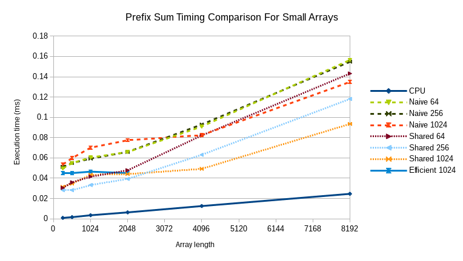
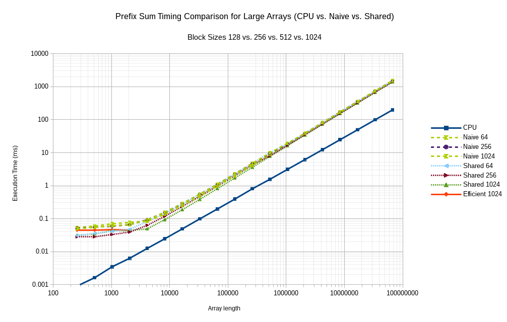
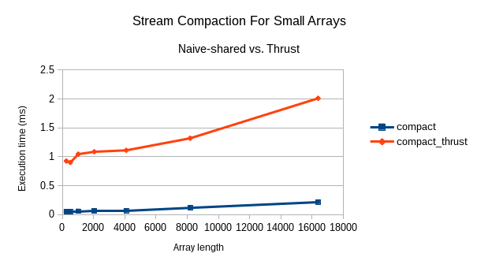
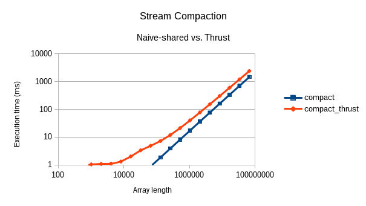

Project-2
=========

* Kai Ninomiya (Arch Linux, Intel i5-4670, GTX 750)

All of the measurements below EXCLUDE memory copy and allocation operations
whenever they are not necessary for the execution of the algorithm by itself.

Part 2
------

* Compare this version to the serial version of exclusive prefix scan. Please
  include a table of how the runtimes compare on different lengths of arrays.

Array Length |      CPU | Naive (blocksize 64)
------------:| --------:| --------------------:
         256 |   0.0009 |              0.04958
         512 |   0.0016 |              0.05488
        1024 |   0.0034 |              0.06039
        2048 |   0.0063 |              0.06573
        4096 |   0.0125 |              0.09094
        8192 |   0.0246 |              0.15645
       16384 |   0.0490 |              0.28979
       32768 |   0.0985 |              0.55294
       65536 |   0.1963 |              1.10467
      131072 |   0.3927 |              2.26979
      262144 |   0.8069 |              4.72594
      524288 |   1.5630 |              9.88322
     1048576 |   3.1083 |             19.22682
     2097152 |   6.1803 |             38.51427
     4194304 |  12.3455 |             80.56889
     8388608 |  24.7172 |            168.44043
    16777216 |  49.4396 |            351.50378
    33554432 |  99.0022 |            732.19421
    67108864 | 198.4291 |           1523.40918

* Plot a graph of the comparison and write a short explanation of the
  phenomenon you see here.

See below.

Part 3
------

* Compare this version to the parallel prefix sum using global memory.
* Plot a graph of the comparison and write a short explanation of the
  phenomenon you see here.

For very small array lengths (less than 4 blocks), performance tapers off to
a constant value. Beyond 4 blocks, the execution time becomes linear in the
array length. 

The naive-shared algorithm consistently outperforms the naive-global algorithm,
but only by a constant amount. This is due to the constant block size, which
limits how much is done in shared memory.

The CPU algorithm universally performs much better than the GPU algorithm.
This is probably due to (1) lack of work efficency in the GPU implementations,
(2) extremely good prediction and prefetching in the CPU for such a simple
algorithm, and (3) lower communication overhead.

Part 4
------

* Compare your version of stream compact to your version using thrust. How do
  they compare? How might you optimize yours more, or how might thrust's stream
  compact be optimized.  

My compaction algorithm could be optimized by using the work-efficient prefix
sum algorithm. There are also some memory copies which could be optimized out.

Using `thrust::copy_if`` has the additional overhead of calling a predicate
function. Depending on the implementation this may not be as fast as having
this check written directly into the kernel. Other Thrust methods, such as
`remove_if`, may have different performance characteristics.
